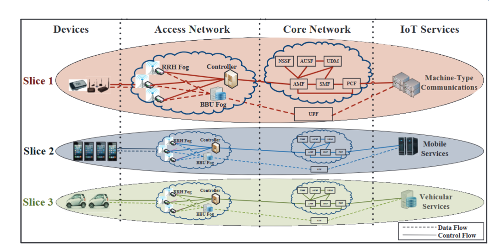

# Efficient and Secure Service-oriented Authentication Supporting Network Slicing for 5G-enabled IoT

## I. Mục tiêu

- Bài báo này thảo luận về các thách thức và giải pháp liên quan đến bảo mật và xác thực trong mạng 5G, đặc biệt là đối với các dịch vụ Internet vạn vật (IoT).

- Đề xuấ một framwork hộ trợ xác thực trong 5G cho IoT và Network slice:

  - Efficient and Secure Service-Oriented Authentication Framework: Một khung xác thực hiệu quả và an toàn, hỗ trợ network slicing và fog computing cho các dịch vụ IoT trong mạng 5G.
  - User Connections and Anonymous Access: Người dùng có thể thiết lập kết nối hiệu quả với mạng lõi 5G và truy cập ẩn danh các dịch vụ IoT thông qua các network slice phù hợp được các nút fog chọn dựa trên loại slice/dịch vụ của các dịch vụ truy cập.

- Cơ Chế Lựa Chọn Slice Bảo Mật:

  - Privacy-Preserving Slice Selection Mechanism: Cơ chế lựa chọn lát cắt bảo vệ quyền riêng tư, giữ kín cả loại slice cấu hình và loại dịch vụ truy cập của người dùng.

- Thoả thuận khoá Key session:
  - Session Keys Negotiation: Khóa phiên được thoả thuận giữa người dùng, các nút fog và các máy chủ IoT để đảm bảo truy cập an toàn dữ liệu dịch vụ trong bộ nhớ đệm fog và máy chủ từ xa với độ trễ thấp.
- Đánh Giá Hiệu Suất:
  - Performance Evaluation: Đánh giá hiệu xuất, tính hiệu quả và khả thi của nó trong hạ tầng 5G.

## II. Problem statement

### 1. Kiến trúc

- Ở trên hình trên thì chúng ta có thể thấy hệ thống kết hợp core 5G và network slicing, fog computing.

- Mạng 5G hướng tới xử lý lượng lớn dữ liệu, kết nối nhiều thiết bị, giảm độ trễ dịch vụ và mang lại mức độ tin cậy mới để cung cấp các dịch vụ tùy chỉnh dựa trên các yêu cầu chất lượng dịch vụ cụ thể. Bằng cách tích hợp các công nghệ mạng mềm hóa, bao gồm network slicing, SDN và fog computing, 5G dự kiến cung cấp ba loại dịch vụ: giao tiếp loại máy quy mô lớn (mMTC, hay còn gọi là IoT quy mô lớn), băng thông rộng di động nâng cao (eMBB) và giao tiếp độ tin cậy cao và độ trễ thấp (UR-LLC).

- Theo tiêu chuẩn 3GPP TS 23.501, kiến trúc 5G bao gồm bốn lớp: thiết bị người dùng, mạng truy cập, mạng lõi và dịch vụ IoT. Các thiết bị người dùng kết nối với mạng dữ liệu thông qua mạng lõi và mạng truy cập và giao tiếp với các máy chủ IoT.

- Core network tách chức năng mặt phẳng người dùng (UPF) khỏi chức năng mặt phẳng điều khiển (CPF) để cho phép mở rộng độc lập và triển khai linh hoạt.

  - UPF bao gồm chuyển tiếp dữ liệu, báo cáo sử dụng lưu lượng, đánh dấu gói ở tầng vận chuyển trong đường lên và đường xuống,...
  - CPF kiểm soát xử lý gói trong UPF bằng cách cung cấp một tập hợp các quy tắc trong các phiên, tức là các quy tắc hành động chuyển tiếp để xử lý gói, các quy tắc phát hiện gói để kiểm tra gói.

  - CPF bao gồm nhiều chức năng, bao gồm Chức năng Quản lý Truy cập và Di động (AMF), Chức năng Quản lý Phiên (SMF), Chức năng Kiểm soát Chính sách (PCF), Chức năng Lựa chọn Mạng Slices (NSSF), Quản lý Dữ liệu (UDM), Chức năng Máy chủ Xác thực (AUSF), v.v., mỗi chức năng có các nhiệm vụ riêng. Cụ thể:

    - AMF: Quản lý đăng ký người dùng, kết nối, khả năng truy cập và di động, xác thực và ủy quyền truy cập.
    - SMF: Bao gồm các chức năng quản lý phiên và chuyển vùng.
    - PCF: Hỗ trợ khung chính sách thống nhất để quản lý hành vi mạng.
    - UDM: Chịu trách nhiệm tạo thông tin xác thực xác thực và quản lý đăng ký.
    - AUSF: Hỗ trợ chức năng máy chủ xác thực.
    - NSSF: Chọn tập hợp các phiên bản mạng slices phục vụ người dùng và xác định Thông tin hỗ trợ mạng Slices (NSSAI) tương ứng với các phiên bản mạng slices áp dụng.

- Network Slicing trong Mạng 5G:

  - Để hỗ trợ các dịch vụ IoT khác nhau trong mạng 5G, network slicing đạt được sự tách biệt và ưu tiên các tài nguyên trên một cơ sở hạ tầng chung, bao gồm khả năng mạng, tài nguyên tính toán, các chức năng mạng ảo và các thiết lập công nghệ truy cập vô tuyến.

  - Mạng 5G trong Hình 1 được chia nhỏ ảo để hỗ trợ các loại dịch vụ IoT khác nhau. Ví dụ, slice 1 được thiết lập cho các giao tiếp loại máy bằng cách thiết lập các chức năng phân phối đầy đủ trên mạng, được tách biệt với các slices dành cho dịch vụ di động và giao tiếp phương tiện. Các điện thoại di động cần một slice end-to-end với băng thông lớn để cho phép các dịch vụ có tốc độ dữ liệu cao và độ trễ thấp, chẳng hạn như phát video và thực tế tăng cường.

  - Các network slices này được quản lý bởi các local control tại biên của mạng truy cập và mặt phẳng điều khiển trong mạng lõi, các bộ điều khiển này chọn các network slices cho các gói sắp tới dựa trên loại slice/dịch vụ và các thông tin phụ trợ khác, và chuyển tiếp các gói tới các máy chủ IoT.

- Access network: Được nâng cấp để hỗ trợ các dịch vụ IoT có yêu cầu độ trễ thấp hoặc cần biết vị trí chính xác. Điều này được thực hiện bằng cách đưa các tài nguyên tính toán và lưu trữ đến gần rìa của mạng truy cập, tức là gần với các thiết bị đầu cuối hơn.
  - Fog Nodes và C-RAN: - Fog Nodes (nút fog) được triển khai trên Cloud-Radio Access Network (C-RAN) để cung cấp giao tiếp baseband tốc độ cao. - C-RAN là một kiến trúc mạng ảo hóa trong đó các trạm phát sóng được chia thành các thành phần như BBU (Baseband Unit) và RRH (Remote Radio Head). - BBU:Cung cấp lưu trữ tập trung và giao tiếp cho các dịch vụ cục bộ trong Access network. Làm việc để xử lý các tín hiệu cơ sở và quản lý kết nối mạng cho nhiều RRH. - RRH: Được trang bị các đơn vị xử lý, tài nguyên lưu trữ, và khả năng tính toán cho các ứng dụng di động yêu cầu nhận diện vị trí và lưu trữ dữ liệu cục bộ. Xử lý tín hiệu radio gần người dùng, giúp giảm độ trễ và cải thiện hiệu suất mạng.
    -Các tài nguyên trong các fog nodes được ảo hóa thành máy ảo (VMs), mỗi VM được kiểm soát bởi một local controller.local controller cung cấp các chức năng như: - Xác thực (authentication) - Cấp quyền (authorization) - Kế toán (accounting) - Phân bổ tài nguyên (resource allocation) - Quản lý di động (mobility management)

### 2. Các mối đe doạ

- Các Loại Tấn Công:

  - Tấn công nghe lén (eavesdropping attacks): Kẻ tấn công có thể nghe lén và bắt giữ các gói dữ liệu đang được truyền.
  - Tấn công trung gian (man-in-the-middle attacks): Kẻ tấn công có thể chiếm đoạt các khóa phiên (session keys).
  - Tấn công theo dõi (stalking attacks): Kẻ tấn công có thể theo dõi vị trí của người dùng.

- Các tấn công từ bên ngoài này xâm nhập vào bảo mật dịch vụ IoT và quyền riêng tư của người dùng, tạo thành các mối đe dọa chính đối với từng thực thể trong kiến trúc dịch vụ IoT.

### 3. Mục tiêu thiết kế

- Đề xuất khung bảo mật ES3A sẽ có các chức năng sau:

  - Chọn Lựa Slice Bảo Vệ Quyền Riêng Tư:
    - Để ngăn chặn rò rỉ quyền riêng tư của người dùng, các loại dịch vụ truy cập sẽ được bảo vệ chống lại các fog nodes không đáng tin hoặc các kẻ tấn công bên ngoài.
    - Việc ánh xạ các NSSAIs được phép và các loại slice đã cấu hình, tức là một phần của NSSAIs được phép áp dụng cho các dịch vụ đã đăng ký, cần được các fog nodes học để chọn các slices phù hợp cho việc chuyển tiếp gói.
  - Xác Thực Ẩn Danh Hướng Dịch Vụ:

    - Người dùng sử dụng các thông tin đăng nhập truy cập, được tạo bởi AUSF và một máy chủ IoT, để xác thực bản thân cho việc truy cập dịch vụ IoT.Không có thông tin đăng nhập truy cập hợp lệ, kẻ tấn công sẽ không thể vượt qua được quá trình xác thực của bộ điều khiển hoặc máy chủ IoT.
    - Trong quá trình xác thực dịch vụ, cả local control lẫn máy chủ IoT không thể biết được danh tính của người dùng, có nghĩa là họ không thể phân biệt được nguồn gốc của một thông điệp xác thực từ hai người dùng khác nhau.

  - Thoả Thuận Khoá Hướng Dịch Vụ:

    - Để bảo vệ dữ liệu dịch vụ, một khoá phiên duy nhất được thỏa thuận giữa máy chủ IoT, bộ điều khiển và người dùng.
    - Không có kẻ tấn công nào có thể biết được khoá phiên đã được thoả thuận hoặc phá hoại quá trình thoả thuận này.
    - Khoá phiên này được sử dụng để mã hóa dữ liệu dịch vụ cho người dùng truy cập vào dịch vụ cụ thể được cung cấp bởi máy chủ IoT.

### III. Thiết kế

#### A. Giải thích một số khái niệm

- Network Slicing là một kỹ thuật cho phép phân chia tài nguyên mạng thành nhiều slices khác nhau, mỗi phần phục vụ các tính năng và tối ưu hóa chức năng mạng riêng biệt.

- Network Slice: Đây là một phần của mạng được phân chia để phục vụ một mục đích hoặc nhóm dịch vụ cụ thể. Ví dụ, một slice có thể được tối ưu hóa cho truyền dữ liệu tốc độ cao, trong khi một slice khác có thể được tối ưu hóa cho độ trễ thấp.

- Single-NSSAI (S-NSSAI): Đây là cách để xác định mỗi network slice. Nó bao gồm:

  - SST (Slice/Service Type): Xác định loại dịch vụ hoặc ứng dụng mà slice đó phục vụ. Ví dụ, SST có thể cho biết liệu slice đó hỗ trợ dịch vụ truyền dữ liệu tốc độ cao (eMBB), truyền dữ liệu với độ trễ thấp (URLLC), hoặc Internet vạn vật (MIoT).
  - SD (Slice Differentiator): Thông tin bổ sung để phân biệt giữa các network slices cùng loại SST. SD giúp phân biệt các slice có cùng loại dịch vụ nhưng được triển khai cho các mục đích khác nhau hoặc trong các môi trường khác nhau.

#### B. Hoạt động

1. System Initialization (Khởi tạo hệ thống)

- AUSF: Thiết lập các tham số hệ thống (P arams) và tạo ra cặp khóa bí mật (a0, a1) và khóa công khai (A0, bA0, bA1) của nhà điều hành 5G.
- IoT Server (ISV) và Local Controller: Cũng tạo cặp khóa bí mật-công khai của riêng họ (b, bB và c, bC).

2. Network Slicing (Phân chia mạng)

- Core Network: Phân chia tài nguyên mạng vật lý thành nhiều network slices.Slice/Service Types (SSTs) và Slice Differentiator (SAIs): Được chỉ định cho các S-NSSAIs cấu hình trên các network slices.
- AMF: Tính toán P Si với khóa bí mật để ẩn các loại dịch vụ của mỗi slice (SSTi) và tạo ACFi để bảo vệ các giá trị tính năng (AiAI) của SSTi.
- Controller: Duy trì S-NSSAIs được bảo vệ (P Si, ACFi) để chọn các network slice phù hợp cho các gói dịch vụ.

3. 5G Network Access

- User (Ui): Tạo cặp khóa bí mật-công khai (uski, upki) và thực hiện đăng ký và xác thực theo 3GPP để truy cập mạng 5G.
- Ui: Nhận thông tin xác thực truy cập mạng và thông tin đăng ký, bao gồm các S-NSSAIs đã đăng ký và thiết lập ngữ cảnh bảo mật Non Access Stratum (NAS).

4. Service Delegation (Ủy quyền dịch vụ)

- Ui: Gửi một tin nhắn NAS và yêu cầu đến AMF để truy cập dịch vụ IoT.
- SMF: Tạo các S-NSSAIs được phép với NSSF.
- AUSF: Ủy quyền khả năng truy cập bằng cách tạo ra vé dịch vụ một phần (PSTi) và chuyển cho ISV.
- ISV: Tạo vé dịch vụ (STi) cho Ui, bao gồm một định danh phiên (Ni), chứng nhận dịch vụ (φi), và thẻ đàm phán khóa (Xi1, Xi2). Ui xác thực φi và nhận các S-NSSAIs được phép cũng như chứng nhận dịch vụ để xác thực dịch vụ ẩn danh.

5. Service Authentication (Xác thực dịch vụ)

- Ui: Tạo một tin nhắn thỏa thuận khóa xác thực (AKAi) và các S-NSSAIs ẩn (P AS).
- Controller: Dựa trên các S-NSSAIs ẩn, tìm network slice phù hợp để truyền tin nhắn mà không biết các loại dịch vụ chi tiết.
- ISV: Xác thực AKAi để cho phép Ui truy cập dịch vụ mà không cần biết danh tính thực của Ui, nếu chứng nhận dịch vụ trong AKAi là hợp lệ. Đồng thời, tạo thẻ đàm phán khóa (Yi1, Yi2) cho thỏa thuận khóa phiên.

6. Key Negotiation (Đàm phán khóa)

- Controller: Tạo thẻ đàm phán khóa của mình (Zi1, Zi2) và tương tác với ISV và Ui để đàm phán khóa phiên (ski) cho các giao tiếp và truy cập dịch vụ an toàn.

Tôi cần biết quy trình hoạt động của nó như nào từ đầu tới cuối

Hiện bản thảo

Tuyệt vời! Tôi sẽ giúp bạn hiểu rõ hơn về quy trình hoạt động của ES3A từ đầu đến cuối.

Quy trình hoạt động của ES3A

ES3A là một khung xác thực dịch vụ định hướng, được thiết kế đặc biệt cho các dịch vụ IoT trong mạng 5G. Quy trình này đảm bảo rằng chỉ những thiết bị được ủy quyền mới có thể truy cập vào các dịch vụ và dữ liệu một cách an toàn.

Các giai đoạn chính của ES3A:

Khởi tạo hệ thống:

Thiết lập mạng: Mạng 5G được thiết lập, bao gồm các thành phần như AMF, SMF, AUSF, UDM, NSSF và PCF.
Khởi tạo tham số bảo mật: Các tham số bảo mật như khóa bí mật, khóa công khai, hàm băm được tạo ra và phân phối cho các thực thể trong hệ thống.
Phân chia mạng: Mạng vật lý được chia thành các lát mạng (network slice) với các dịch vụ và tính năng khác nhau.
Truy cập mạng 5G:

Đăng ký: Người dùng đăng ký với mạng 5G và nhận thông tin đăng ký, bao gồm các dịch vụ đã đăng ký.
Xác thực: Người dùng thực hiện xác thực với AUSF để chứng minh danh tính.
Ủy quyền dịch vụ:

Yêu cầu dịch vụ: Người dùng gửi yêu cầu truy cập dịch vụ đến AMF.
Tạo vé dịch vụ: AMF tạo vé dịch vụ một phần và gửi đến ISV.
Xác thực vé dịch vụ: ISV xác thực vé dịch vụ và tạo vé dịch vụ đầy đủ cho người dùng.
Xác thực dịch vụ:

Tạo thông điệp xác thực: Người dùng tạo một thông điệp xác thực bao gồm thông tin về dịch vụ yêu cầu và các thông tin xác thực khác.
Xác thực thông điệp: ISV xác thực thông điệp và kiểm tra xem người dùng có quyền truy cập dịch vụ hay không.
Ẩn thông tin dịch vụ: Người dùng ẩn thông tin về dịch vụ mà họ đang truy cập để bảo vệ quyền riêng tư.
Đàm phán khóa phiên:

Tạo khóa phiên: Các thực thể tham gia (người dùng, ISV, controller) cùng nhau đàm phán và tạo ra một khóa phiên để bảo mật giao tiếp.
Các hoạt động chi tiết hơn:

Mỗi giai đoạn đều sử dụng các thuật toán mã hóa, băm để bảo vệ thông tin.
Network slicing giúp phân chia tài nguyên mạng hiệu quả và cung cấp các dịch vụ tùy chỉnh cho từng người dùng.
Bilinear pairing được sử dụng để thực hiện các phép tính toán phức tạp nhằm đảm bảo tính an toàn của hệ thống.
Các thông điệp được xác thực bằng chữ ký số để đảm bảo tính toàn vẹn và không thể phủ nhận.
Tổng kết:

ES3A là một quy trình phức tạp, bao gồm nhiều bước và sử dụng các công nghệ mã hóa tiên tiến. Mục tiêu chính của ES3A là đảm bảo tính bảo mật, tính toàn vẹn và tính riêng tư cho các dịch vụ IoT trong mạng 5G.

Bạn có muốn tìm hiểu sâu hơn về một khía cạnh cụ thể nào trong quy trình này không? Ví dụ:

Bạn muốn hiểu rõ hơn về cách thức hoạt động của bilinear pairing?
Bạn muốn biết chi tiết về quá trình xác thực dịch vụ?
Bạn quan tâm đến cách thức ẩn thông tin dịch vụ của người dùng?
Hãy cho tôi biết để tôi có thể giải thích chi tiết hơn.

https://gemini.google.com/app/bbd3d4c47d8a5637?hl=vi
