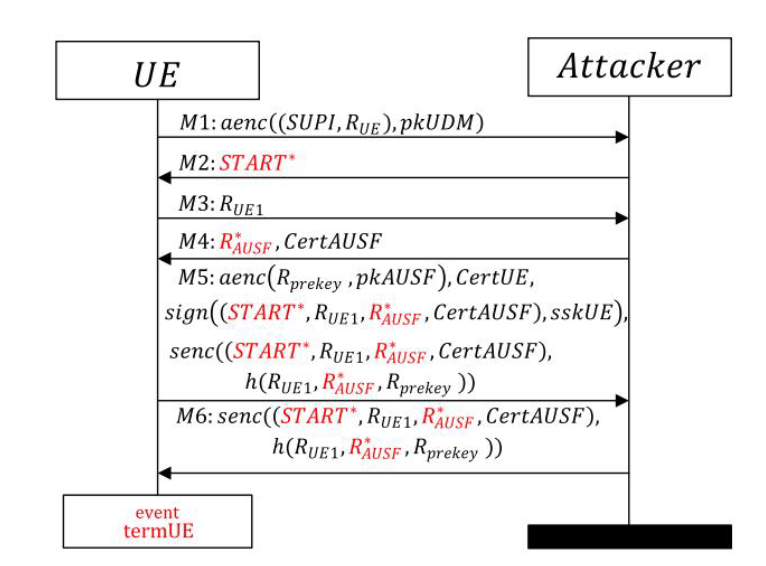

# Formal Analysis of 5G EAP-TLS Authentication Protocol Using Proverif

## I. Summarize 

- Trong bài báo này họ thực hiện áp dụng EAP-TLS vào core 5G và thực hiện phân tích bảo mật tự động của mô hình giao thức chính thức bằng cách sử dụng công cụ kiểm tra ProVerif

- Họ đưa ra được một số sai sót trong giao thức EAP-TLS

- Đưa ra khắc phục các sai sót trên

## II. Related work

- Các công trình liên quan [19], [20], trong đó các tác giả đã phân
tích các thuộc tính bảo mật của giao thức 5G AKA (và biến thể EAP-AKA
của nó) dựa trên bộ phân tích giao thức TAMARIN [21]. 

&rarr; Họ nhận thấy rằng chưa có ai phân tích bảo mật về EAP-TLS và đánh giá bảo mật về nó

## III. GIAO THỨC XÁC THỰC EAP-TLS

- Ở đây họ coi kêng giuawx UE và serving network là không an toàn 

- Kênh giữa Serving network và Home network là an toàn

- Module chính của serving network là SEAF đóng vai trò là người trung gian ở giữa chuyển tiếp các tin nhắn giữa thiết bị người dùng 
và home network

- Ngược lại với 5G-AKA thì serving network của EAP-TLS sẽ không tham gia vào quá trình tính toán mà tham gia vào quá trình định tuyến cấp thấp hơn.

- Home network bao gồm: 
    - AUSF: Thực hiệN xác thực UE 
    - UDM: Lưu trữ database
    - ARPF: (Authentication Credential Repository and Processing Function) Xử lý và lưu trữ thông tin xác thực. Lựa chọn phương thức xác thực dựa trên nhận dạng thuê bao và chính sách được định cấu hình, sau đó tính toán dữ liệu xác thực và tài liệu khóa cho AUSF
    - SIDF: (Subscription Identifier De-concealing Function) Khử mã định danh đăng ký. Chịu trách nhiệm giải mã tin nhắn từ người đăng ký và cũng truy xuất danh tính SUPI của người đăng ký

### A. Nguyên lý hoạt động

- Hình trên mô tả quá trình hoạt động của EAP-TLS

- Các bước hoạt động như sau:

    - UE sử dụng khoá công khai của UDM ở đây là pK-UDM để mã hoá mã SUPI và số ngẫu nhiên R-UE xử dụng mã hoá bất đối xứng ký hiệu là  aenc(·, pkUDM ). Trong đó dấu . đại diện cho SUPI và R-UE.

    - Serving network nhận được data thì nó sẽ chuyển tiếp data này cho AUSF kèm với tên SEAFN

    - AUSF check tên SEAFN mà serving network gửI tới xem nó có đánh tin cậy hay không. Nêú thành công thì nó sẽ chuyển tiếp SUCI này tới cho UDM. 

    -  UDM sẽ sử dụng khoá private UDM để giải mã SUCI và lấy ra được SUPI. Nêú SUPI legit thì UDM sẽ gửi lại resp bao gốm SUPI và các phương thức xác thực được chọn. Trong th này nó biểu thị là đùng EAP-TLS.

    - AUSF gửi tin nhắn START-TLS tới cho UE và bắt đầu quá trực xác thực bằng EAP-TLS

    - UE tạo ra một random mới là RUE-1 và các thuật toán được hỗ trợ methods-UE cho SEAF. SEAF chuyển tiếp tới AUSF

    - AUSF resp một tin nhắn tới UE thông qua SEAF,trong đó có R-AUSF nonce , Cert_AUSF và các thông tin thuật toán mã nó hỗ trợ methods-AUSF

    - Khi UE nhận được data từ AUSF. UE sẽ xác thực Cert-AUSF để đảm bảo rằng nó đang connect tới một AUSF legit. 

    - Sau khi xác minh thành công thì UE sẽ tạo ra một random R-prekey nonce mới.

    - Sau đó UE tạo ra khoá K-session bằng R-prekey, RUE-1, R-AUSF
    - UE cũng tạo một hash(hanshake-UE) với data từ bước 2-4

    - Data chúng ta sẽ gửI đi:
        - {R-prekey} được mã hoá bằng public key của AUSF - pk-AUSF. 
        - Cert-UE
        - Ký {hash(hanshake-UE)} sử dụng khoá private của UE là ssk-UE. 
        - Mã hoá {hash(hanshake-UE)} sử dụng khoá K-session tạo được ở trên.

    - Sau khi nhận được data từ UE. AUSF thực hiện xác thực cert-UE. Sử dụng khoá K-private AUSF để tính toán R-prekey Và từ đó tính toán khoá Ksession. 

    - Sử dụng khoá K session đó để giải mã và lấy ra được hash(hanshake-UE). AUSF cũng tạo ra chữ ký hash(hanshake-AUSF) và so sánh với hash(hanshake-UE) nếu nó bằng thì tức là UE legit.

    - Vậy một chữ ký {hash(hanshake-UE)} sử dụng khoá private của UE đâu?

    - Tại đây em nhìn thấy có một lỗ hổng là:
        

        - Nếu một attacker có thể đứng ở giưã UE và AUSF thì attacker có thể làm những gì?

        - Nhìn vào hình trên có thể thấy RUE-1, R-AUSF đều được gửi dưới dạng bản rõ. Mà 2 giá trị này lại là input tạo ra khoá Ksession. Nếu attacker thao túng R-prekey thì nó có thể tạo ra một K-session mới sử dụng thông tin của UE victim. Lúc này AUSF hiểu nhầm attacker là UE victim.

        - Đến đây thì họ mới sinh ra một cái hash nữa sử dụng khoá k private của UE là {hash(hanshake-UE)}ssk-UE. 

        - Khi bên AUSF nhận được data từ UE nó sẽ check cert-UE và lấy public của UE được lưu trong cert đó và sử dụng khoá Public key đó tính toán hash và compare nó với hash {hash(hanshake-UE)}ssk-UE. Nếu đúng thì nó có thể đảm bảo rằng dữ liệu không bị thay đổi trên đường truyền.

        - TUY NHIÊN khi em đọc kỹ lại thì cái giá trị hash(hanshake-UE) họ đang dùng là dữ liệu 2-4 đă nhắc đến trước đó. Vậy vấn đề lỗ hổng vẫn chưa được giải quyết và nó vẫn nằm ở đó. 

        - Tiếp theo UE nhận được một chữ ký hash(hanshake-AUSF) và nó xác thực chữ ký này. Nếu đúng thì nó bắt đầu TLS-connection.

        - AUSF sau đó sẽ tạo ra một khoá k-seaf và gửi cho SEAF và mã SUPI cho SEAF và tín nhắn success.

        - SEAF resp success cho UE và UE cũng tính ra được khoá chung Kseaf với SEAF từ đây cả 2 đã có thể kết nối an toàn. 

### B. Các sai sót trong thiết kế bảo mật

1. Lỗ  hổng đầu tiên là attacker đứng ở giữa UE và SEAF và nó sẽ giả mạo AUSF và gửi random R*-AUSF tới cho UE và UE xác thực cert-AUSF đúng và sử dụng R*-AUSF này để tạo khóa K-session

2. Lỗ hổng thứ 2 là attacker sẽ giả mạo UE để connect tới AUSF

### C. Vá lỗ hổng

- Ở đây họ vá lỗ hổng này bằng cách ký data gửi đi

- Nhìn vào hình dưới đây có thể thấy bước số 2 AUSF sử dụng khóa K public của UE để mã hóa dữ liệu gửi đi và UE dùng private key để giải mã

- Bước 3 UE sử dụng private key để mã hóa và AUSF sử dụng public key để giải mã. 

### D. Cách sửa của em
