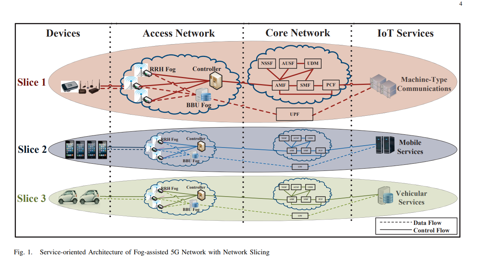

#

## 1. Efficient and Secure Service-oriented Authentication Supporting Network Slicing for 5G-enabled IoT

- Link https://sci-hub.se/https://ieeexplore.ieee.org/document/8314666

### Mục tiêu

- Xác Thực Dựa Trên Dịch Vụ: Bài báo đề xuất một khung bảo mật cho xác thực hiệu quả, hỗ trợ cắt lớp mạng và tính toán sương mù.
- Network slicing: Tạo ra nhiều mạng ảo trên cùng một cơ sở hạ tầng vật lý, mỗi mạng được tối ưu hóa cho các dịch vụ hoặc ứng dụng khác nhau.
- Fog computing: Đưa tài nguyên tính toán gần hơn với nguồn dữ liệu để giảm độ trễ và cải thiện hiệu suất.
- Truy cập ẩn danh: Người dùng có thể kết nối với mạng 5G và truy cập các dịch vụ IoT mà không cần tiết lộ danh tính của họ.
- Chọn Lọc slice Bảo Mật Riêng Tư: Cơ chế giữ gìn sự riêng tư của người dùng bằng cách ẩn đi loại cắt lớp mạng và dịch vụ mà họ đang truy cập.
- Khóa Phiên: Khung bảo mật bao gồm phương pháp thỏa thuận khóa phiên giữa người dùng, các nút sương mù địa phương và các máy chủ IoT. Điều này đảm bảo việc truy cập an toàn vào dữ liệu dịch vụ được lưu trữ trong bộ nhớ đệm sương mù và các máy chủ từ xa.

- Đánh Giá Hiệu Suất: Bài báo đánh giá hiệu suất của khung bảo mật thông qua các mô phỏng, cho thấy tính hiệu quả và khả thi của nó trong môi trường 5G.

--> Đề xuất khung bảo mật ES3A:Đảm bảo việc truy cập dịch vụ IoT một cách an toàn mà không làm lộ quyền riêng tư của người dùng trong môi trường 5G. Tích hợp cắt lớp mạng và tính toán sương mù cho phép người dùng truyền dữ liệu dịch vụ trên các lớp mạng phù hợp với tính năng cách ly dữ liệu và dịch vụ tùy chỉnh.

## 2. Towards Secure Slicing: Using Slice Isolation to Mitigate DDoS Attacks on 5G Core Network Slices

### Mục tiêu

- Giải pháp để chủ động giảm thiểu các cuộc tấn công Từ chối Dịch vụ Phân tán (DDoS) trong việc network slicing 5G core thông qua việc insolation các phân vùng mạng.
- Phân chia mạng là một trong những công nghệ chính cho phép các mạng 5G cung cấp tài nguyên riêng biệt cho các ngành công nghiệp khác nhau (dịch vụ). Tuy nhiên, một cuộc tấn công DDoS có thể ảnh hưởng nghiêm trọng đến hiệu suất và khả năng sẵn sàng của các phân vùng.

## 3. Secure Keying Scheme for Network Slicing in 5G Architecture

### Mục tiêu

- Đề xuất một chế độ quản lý khóa bảo mật phù hợp cho kiến trúc network slicing khi các slice được truy cập bởi các ứng dụng của bên thứ ba. Chế độ quản lý khóa bảo mật này được thiết kế dựa trên cơ chế tính toán nhiều bên (multi-party computation), đảm bảo sự đồng thuận từ các trường hợp sử dụng hoặc thiết bị mà dữ liệu được thu thập.

- Hiệu suất: Đánh giá hiệu quả của chế độ quản lý khóa.
- Khả năng mở rộng: Kiểm tra khả năng mở rộng của chế độ quản lý khóa trong bối cảnh 5G đang phát triển.
- Tính bảo mật: Phân tích các thuộc tính bảo mật của chế độ quản lý khóa để chứng minh sự phù hợp của nó trong các mô hình mạng 5G.

## 4. Enhancing Security and Privacy Implications in 5G Network Slicing

- Link: https://ieeexplore.ieee.org/abstract/document/10469006

## 5. An Experimental 5G Testbed for Secure Network Slicing Evaluation

- Link: https://ieeexplore.ieee.org/document/10056616

## REFERENCE

1. https://ieeexplore.ieee.org/document/10056616
2. https://sci-hub.se/https://ieeexplore.ieee.org/document/8314666
3. https://sci-hub.se/https://ieeexplore.ieee.org/document/8802852
4. https://sci-hub.se/https://ieeexplore.ieee.org/document/8377298
5. https://ieeexplore.ieee.org/stamp/stamp.jsp?tp=&arnumber=8315003
6. attack: https://sci-hub.se/https://ieeexplore.ieee.org/document/8792139
7. https://www.sci-hub.se/https://ieeexplore.ieee.org/document/8931330
8. https://ieeexplore.ieee.org/stamp/stamp.jsp?tp=&arnumber=9099823
9. https://sci-hub.se/https://ieeexplore.ieee.org/document/9364272
10. https://info.enea.com/Slicing-Security-in-5G-Core-Networks
